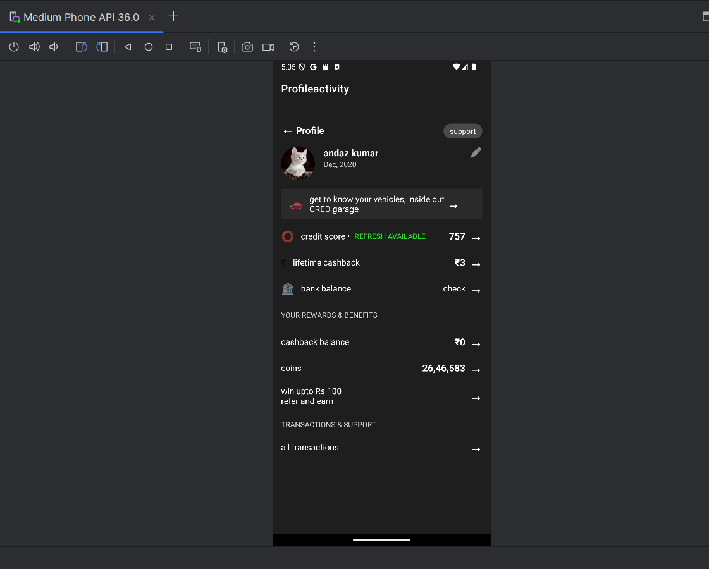

# ProfileactivityAndroid

This is a Profile Activity UI built with Android (Kotlin, XML, Firebase) for an internship assignment. The app replicates the provided UI screenshot and fetches user data dynamically from Firebase.

## Screenshots




## Setup Instructions

1. **Clone the Repository**:
   ```bash
   git clone https://github.com/sharifShaikh1/ProfileactivityAndroid.git
   cd ProfileactivityAndroid
